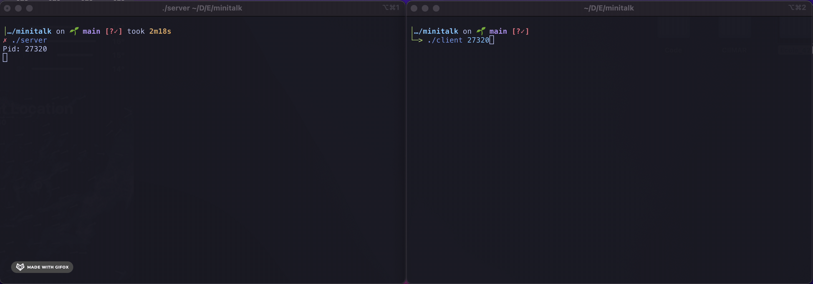

# About
This project implements a data exchange program using Unix signals. the client uses ``SIGUSR1`` and ``SIGUSR2`` to send binary ASCII code to the server. The server is listening for those signals and convert back the characters into bytes. the bytes are appened to each other until the null terminator is received and the message printed. more info: [subject.pdf](https://github.com/Axel-ex/minitalk/blob/main/subject.pdf)

## Usage

First ``git clone`` and ``cd`` into the repository. then ``make``. the makefile will create a server and a client executable file. first run the server: 

    ./server

The server will display it's process ID (**PID**). Open another terminal window and run:

    ./client <server_pid> <message_str>
